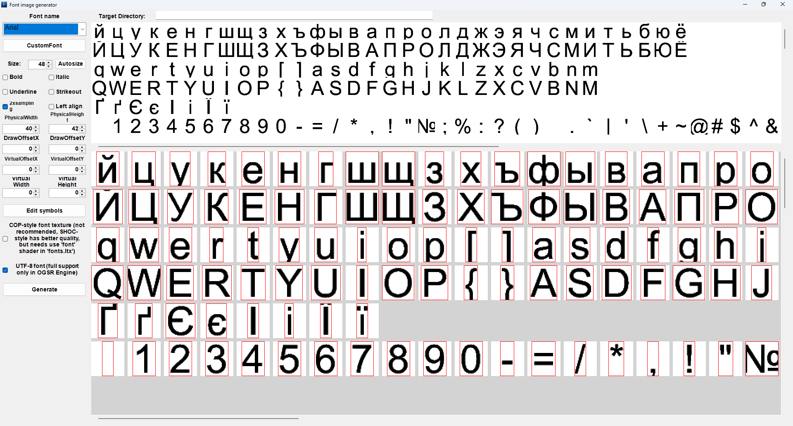

# Fonts Generator

___

## Info

<table>
  <tbody>
    <tr>
      <td>Program Developer</td>
      <td><Authors
          authors={['ogsr_team']}
          size="small"
          showTitle={false}
        /></td>
    </tr>
    <tr>
      <td>Described Version</td>
      <td>[1.14](https://github.com/OGSR/Fonts_generator/releases/tag/1.14)</td>
    </tr>
    <tr>
      <td>Source Code</td>
      <td>[GitHub](https://github.com/OGSR/Fonts_generator)</td>
    </tr>
    <tr>
      <td>Documentation</td>
      <td>[DeepWiki](https://deepwiki.com/OGSR/Fonts_generator)</td>
    </tr>
  </tbody>
</table>

## About

Fonts Generator is a Windows-based toolset for generating bitmap fonts compatible with the X-Ray Engine. The system converts TrueType/OpenType fonts into game-ready assets consisting of *.dds texture files and \*.ini coordinate configuration files.

## Functionality

<table>
  <thead>
    <tr>
      <th>Font name</th>
      <th>Select installed system fonts</th>
    </tr>
  </thead>
  <tbody>
    <tr>
      <td>CustomFont</td>
      <td>Select external *.ttf or *.otf font</td>
    </tr>
    <tr>
      <td>Size</td>
      <td>Font size</td>
    </tr>
    <tr>
      <td>Autosize</td>
      <td>Automatically calculate optimal physical dimensions based on the largest glyph in the test strings</td>
    </tr>
    <tr>
      <td>Bold</td>
      <td>Bold weight</td>
    </tr>
    <tr>
      <td>Italic</td>
      <td>Italic slant</td>
    </tr>
    <tr>
      <td>Underline</td>
      <td>Underline decoration</td>
    </tr>
    <tr>
      <td>Strikeout</td>
      <td>Strikeout decoration</td>
    </tr>
    <tr>
      <td>2xsampling</td>
      <td>Enables 2x supersampling anti-aliasing for improved glyph quality</td>
    </tr>
    <tr>
      <td>Left aligh</td>
      <td>Controls horizontal glyph alignment within the virtual box</td>
    </tr>
    <tr>
      <td>PhysicalWidth</td>
      <td>Glyph cell width</td>
    </tr>
    <tr>
      <td>PhysicalHeigh</td>
      <td>Glyph cell height</td>
    </tr>
    <tr>
      <td>DrawOffserX</td>
      <td>Horizontal rendering offset</td>
    </tr>
    <tr>
      <td>DrawOffsetY</td>
      <td>Vertical rendering offset</td>
    </tr>
    <tr>
      <td>VirtualOffsetX</td>
      <td>Virtual box X position</td>
    </tr>
    <tr>
      <td>VirtualOffsetY</td>
      <td>Virtual box Y position</td>
    </tr>
    <tr>
      <td>VirtualWidth</td>
      <td>Virtual box width delta</td>
    </tr>
    <tr>
      <td>VirtualHeigh</td>
      <td>Virtual box height delta</td>
    </tr>
    <tr>
      <td>Edit symbols</td>
      <td />
    </tr>
    <tr>
      <td>COP-style font texture</td>
      <td>Compatibility mode for S.T.A.L.K.E.R.: Call of Pripyat (CoP) font format</td>
    </tr>
    <tr>
      <td>UTF-8 font</td>
      <td>Controls the output format of the *.ini file generated during post-processing</td>
    </tr>
    <tr>
      <td>Generate</td>
      <td>Generate texture and *.ini file</td>
    </tr>
  </tbody>
</table>
