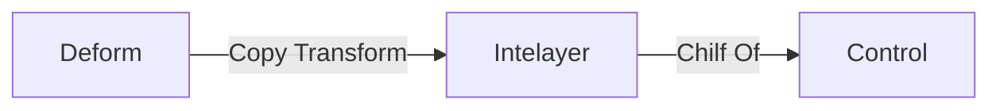

---
tags:
    - Blender
    - 3D Animation
title: How to Rig in Blender
draft: true
---

# How to Rig in Blender

___

<Authors
  authors={["theparazit"]}
  size="medium"
  showTitle={true}
  showDescription={true}
/>

## About

Данная статья расскажет о том, как сделать риг для уже существующих скелетов, дабы сохранить совместимость.

## Forward

Итак, вы захотели сделать анимацию для NPC, мутанта или рук игрока (HUD Обьекта), при этом, сохранив совместимость с уже существующими анимациями.

:::info
Так как некоторые кости захардкожены в движке ([например Actor_Network.cpp](https://github.com/themrdemonized/xray-monolith/blob/all-in-one-vs2022-wpo/src/xrGame/Actor_Network.cpp#L822)), то мы не можем удалять их. Это значит, что совместимость с уже существующими анимациями диктуется скелетом (набором костей в иерархии).
Например, если вы удалите кость, на которую ссылается движок, то может случится вылет. Если поменяете изначальную Bind позу кости, то могут появится оффсеты в анимации и т.д.
:::

## Концепция

Основная концепция данного подхода лежит в том, дабы сохранить оригинальные трансляции костей (в их изначальной Bind позе). При импорте вы увидите, что кости могут быть повернуты хаотично, но технически это правильно.

:::info
Так происходит из-за того, что изначально они были сделаны Max или Maya
:::

Идея заключается в том, чтобы поделить скелет на три слоя:

- Деформационные кости - Оригинальные деформационные кости
- Промежуточные - Недеформационные кости. Служат требуемым промежутком, между оригинальными и контроль костями
- Контролы - Недеформационные кости для контроля. Именно с помощью них в итоговом риге будет осуществляться управление.

Цепочка для одной связки костей должна выглядить так:

## Пример

Давайте возьмем скелет сталкера

Импортируйте его в Blender

Я создал и переимновал 3 группы костей

Дублирую кости и размещаю их в нужные коллекции для удобства

У коллекции костей Interlayer у каждой кости НЕ должно быть родителя

Переименовываю две коллекции костей для удобства

У двух коллецией костей убрал галочку Deform

Беру деформационную кость и через Copy Transform модификатор прикрепляю ее к кости Interlayer. Далее кость Interlayer прикрепляю к Control кости

:::tip
Из-за подобной иэрархии костей нам открывается возможность распологать Control кости как хотим. Поэтому им можно менять трансляции под ваши нужды.
:::

