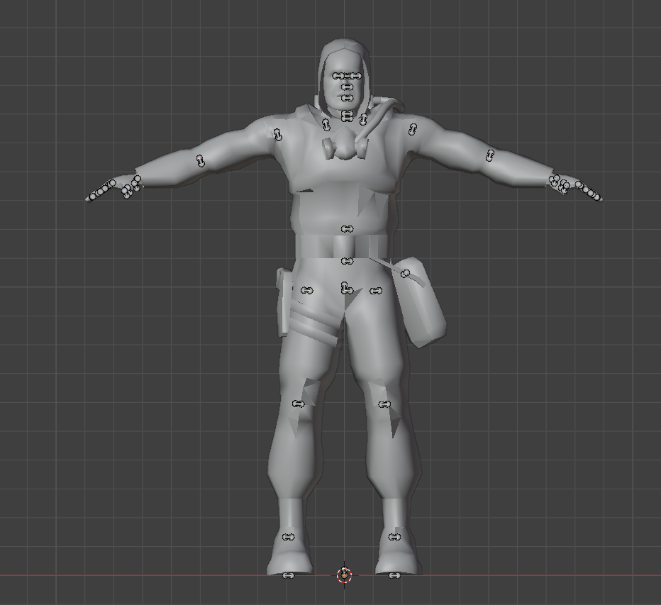
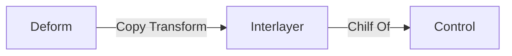
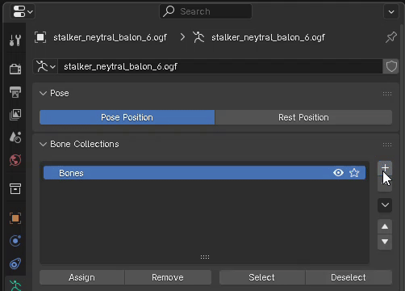
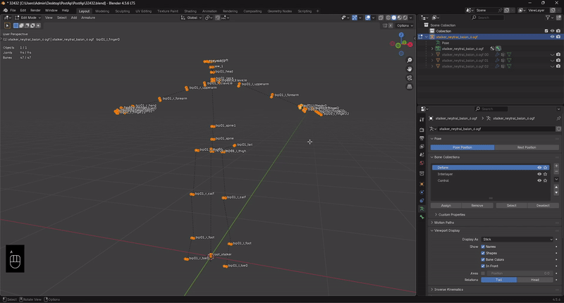
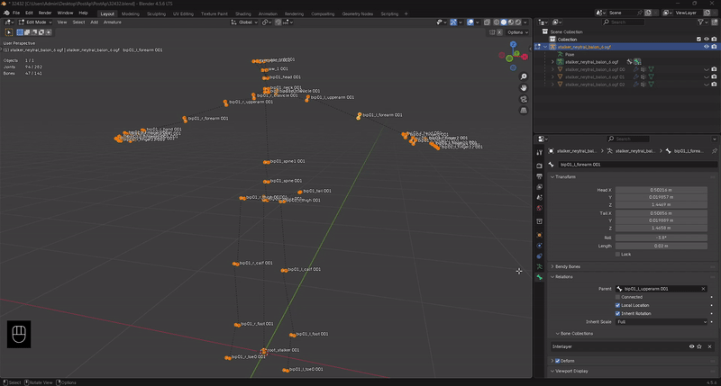
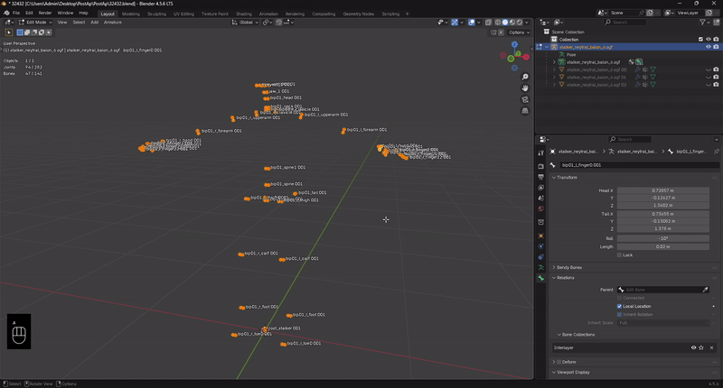

---
tags:
  - Blender
  - 3D Animation
title: How to Rig in Blender
draft: true
keywords:
  - Blender
  - Rigging
  - 3D
---

# How to Rig in Blender

___

<Authors
  authors={["theparazit"]}
  size="medium"
  showTitle={true}
  showDescription={true}
/>

## About

Данная статья расскажет о том, как сделать риг для уже существующих скелетов, дабы сохранить совместимость.

## Forward

Итак, вы захотели сделать анимацию для NPC, мутанта или рук игрока (HUD Обьекта), при этом, сохранив совместимость с уже существующими анимациями.

:::info
Так как некоторые кости захардкожены в движке ([например Actor_Network.cpp](https://github.com/themrdemonized/xray-monolith/blob/all-in-one-vs2022-wpo/src/xrGame/Actor_Network.cpp#L822)), то мы не можем удалять их. Это значит, что совместимость с уже существующими анимациями диктуется скелетом (набором костей в иерархии).
Например, если вы удалите кость, на которую ссылается движок, то может случится вылет. Если поменяете изначальную Bind позу кости, то могут появится оффсеты в анимации и т.д.
:::

## Концепция

Основная концепция данного подхода лежит в том, дабы сохранить оригинальные трансляции костей (в их изначальной Bind позе). 

:::info
При импорте вы увидите, что кости могут быть повернуты хаотично, но технически это правильно.



Так происходит из-за того, что изначально они были сделаны Max или Maya
:::

Идея заключается в том, чтобы поделить скелет на три слоя:

- Деформационные кости - Оригинальные деформационные кости
- Промежуточные - Недеформационные кости. Служат требуемым промежутком, между оригинальными и контроль костями
- Контролы - Недеформационные кости для контроля. Именно с помощью них в итоговом риге будет осуществляться управление.

Цепочка для одной связки костей должна выглядить так:



## Пример

### Import

### Deform bones

Давайте возьмем скелет сталкера и импортируем его в Blender


#### Creating collections

Я создал и переимновал 3 коллеции костей



#### Duplicate bones

Дублирую кости, размещаю их в нужные коллекции для удобства и удаляю в ненужной коллеции



### Interlayer bones

#### Delete parents and deform checkmark

У коллекции костей Interlayer у каждой кости НЕ должно быть родителя и они НЕ должны быть Deform



:::tip
Чтобы быстро массово отредактировать кости (отключить, включить галочки, удалить родителей) у выделенных костей можно зажать клавишу ALT
:::

#### Rename bones

Переименовываю дубликат костей находящийся в коллеции Interlayer в _INTRLR для удобства



:::tip
Чтобы быстро переименовать все выделенные кости можно воспользоваться функцией Bone Rename (F3 -> Bone Rename)
:::info
Обычно к сдублированным костям прибовляется суффикс .001
:::

#### Connect Deform and Interlayer bones

После того, как наши Interlayer кости готовы, то можно начать прикреплять их к деформационным костям

Беру деформационную кость в Pose Mode и через Copy Transform модификатор прикрепляю ее к кости Interlayer. Так нужно сделать со всеми костями!


:::info
Благодаря этому, Deform кости не будут двигаться, а будут копировать трансляции Intrerlayer кости к которой прикреплена. Данная цепочка поможет в дальнейшем.
:::

:::tip
```python
import bpy

def add_copy_transforms_constraint():
    # Проверяем активный объект
    if bpy.context.active_object is None:
        print("Нет активного объекта")
        return
    
    obj = bpy.context.active_object
    
    # Проверяем, что активный объект - арматура
    if obj.type != 'ARMATURE':
        print("Активный объект не является арматурой")
        return
    
    # Проверяем режим редактирования/позы
    if bpy.context.mode not in ['EDIT_ARMATURE', 'POSE']:
        print("Перейдите в режим Edit или Pose mode")
        return
    
    # Получаем список выбранных костей
    selected_bones = []
    
    if bpy.context.mode == 'EDIT_ARMATURE':
        selected_bones = [b.name for b in obj.data.edit_bones if b.select]
    elif bpy.context.mode == 'POSE':
        selected_bones = [b.name for b in obj.pose.bones if b.bone.select]
    
    if not selected_bones:
        print("Нет выбранных костей")
        return
    
    # Для каждой выбранной кости
    for bone_name in selected_bones:
        # Получаем pose кость
        pose_bone = obj.pose.bones.get(bone_name)
        
        if not pose_bone:
            continue
        
        # Создаем имя кости-цели с суффиксом _INTRLR
        target_bone_name = f"{bone_name}_INTRLR"
        
        # Проверяем существует ли кость-цель
        if target_bone_name not in obj.pose.bones:
            print(f"Кость-цель {target_bone_name} не найдена для кости {bone_name}")
            continue
        
        # Добавляем constraint
        constraint = pose_bone.constraints.new(type='COPY_TRANSFORMS')
        constraint.name = f"Copy Transforms_{bone_name}"
        constraint.target = obj  # Устанавливаем арматуру как target
        constraint.subtarget = target_bone_name  # Устанавливаем кость-цель
        
        # Дополнительные настройки (опционально)
        constraint.target_space = 'WORLD'
        constraint.owner_space = 'WORLD'
        constraint.mix_mode = 'REPLACE'
        
        print(f"Добавлен constraint для кости {bone_name} -> {target_bone_name}")

# Запускаем функцию
add_copy_transforms_constraint()
```
:::

### Control bones

#### Connect Interlayer and Control bones

Deform и Interlayer кости закреплены, осталось лишь закрепить Interlayer и Control кости

:::info
Из-за подобной иэрархии костей нам открывается возможность распологать Control кости как хотим. Поэтому им можно менять трансляции под ваши нужды.
:::

